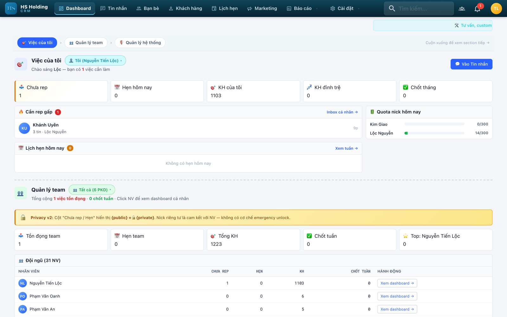
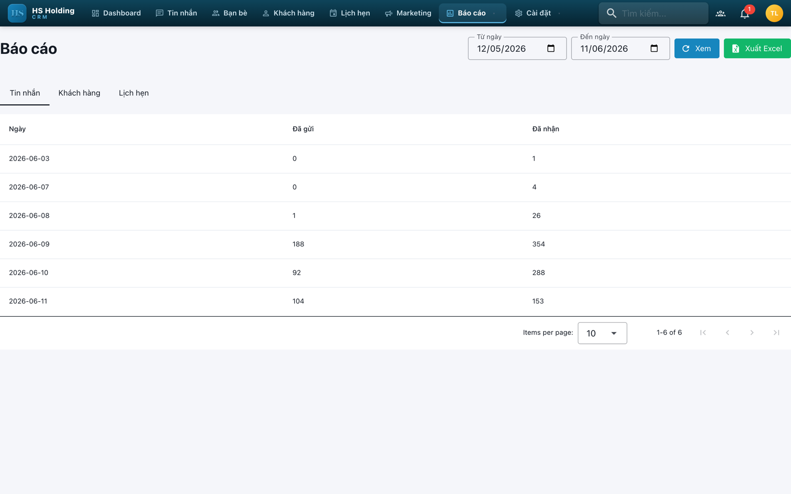
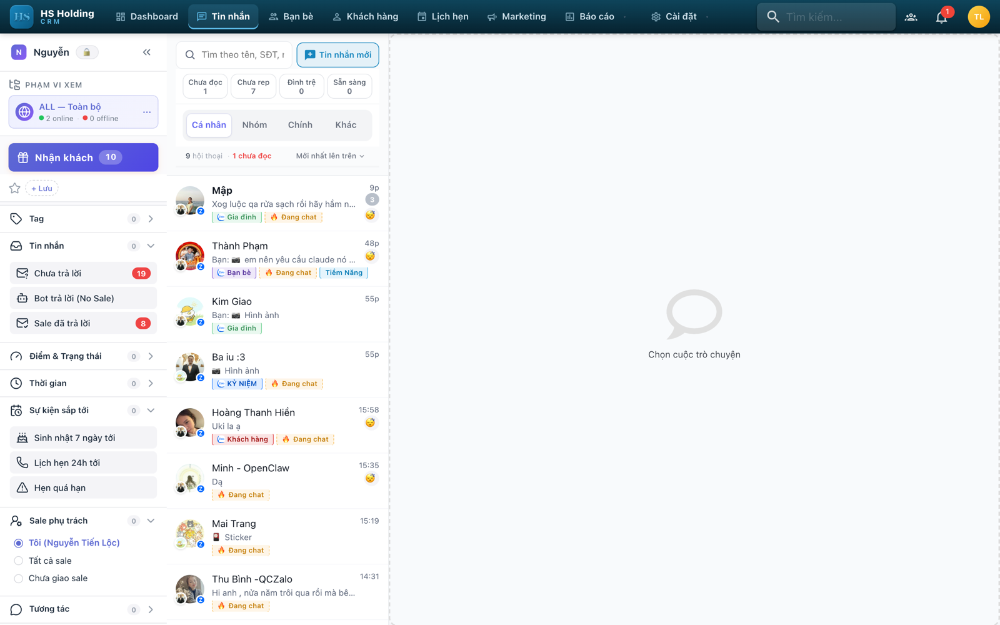
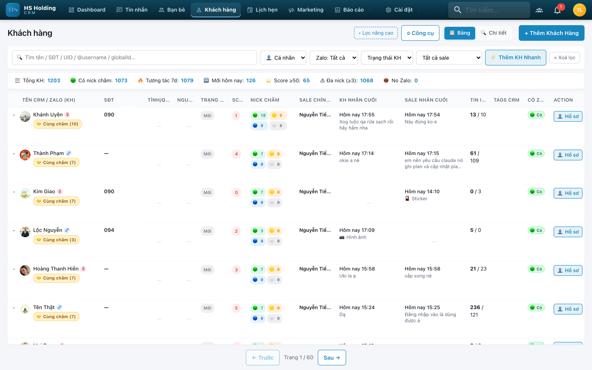
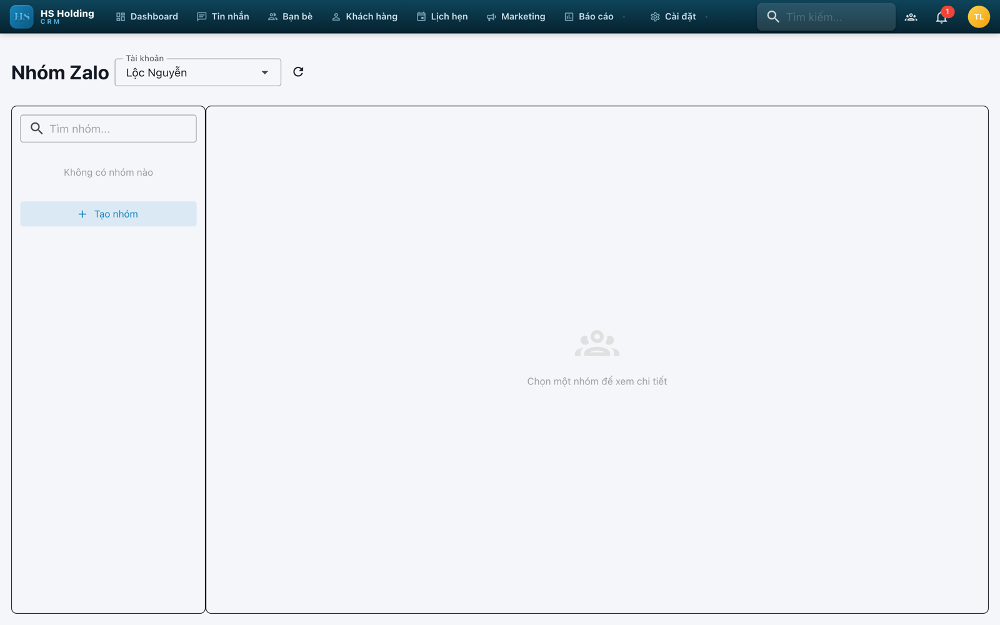
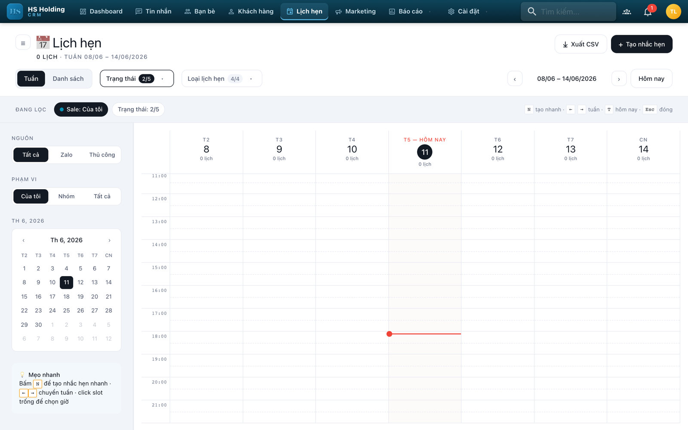

# ZCRM v3.4 — Quản lý nhiều tài khoản Zalo cá nhân

Quản lý tập trung nhiều nick Zalo trên một giao diện web: chat real-time, gửi ảnh/video/file, cầu **Zalo ↔ Telegram** 2 chiều, **AI agent tự chăm khách**, phân tích hội thoại sale qua MCP, báo cáo và PWA mobile.

**Mã nguồn mở** theo **AGPL-3.0** (dual-license thương mại) — [github.com/rocket-ai-global/rocket-zalo-crm](https://github.com/rocket-ai-global/rocket-zalo-crm)

## Ảnh chụp giao diện

| Dashboard | Báo cáo |
|---|---|
|  |  |

| Chat | Khách hàng |
|---|---|
|  |  |

| Nhóm | Lịch hẹn |
|---|---|
|  |  |

## Tính năng

<a id="ai-phat-trien-them"></a>

### 🤖 AI — phần phát triển thêm (Tony Hoang)

Điểm khác biệt chính so với dự án gốc: CRM không chỉ *lưu* hội thoại mà **tự trả lời khách và chấm chất lượng tư vấn của sale**.

**1. AI Agent tự chăm khách trên Zalo** — mỗi agent có prompt riêng + kho tài liệu riêng (RAG), gán theo **từng nick hoặc từng nhóm**, giữ bubble "đang soạn tin" suốt lượt trả lời, có trigger gate và bàn giao cho người thật. → [Hướng dẫn](docs/HUONG-DAN-CAU-HINH-AI-AGENT.md)

**2. Nối Rocket Agent làm "bộ não"** — cắm agent có công cụ và ngữ cảnh dài vào thay cho model đơn lẻ. Hai cách gọi: `http` (cổng OpenAI-compatible từng profile, dùng được khi backend chạy Docker) hoặc `cli`. CRM tự đọc cổng + khoá từ profile, chọn bằng dropdown, có model dự phòng. → [Hướng dẫn](docs/HUONG-DAN-KET-NOI-ROCKET-AGENT.md)

**3. Agent + MCP phân tích hội thoại sale** — bề mặt **MCP read-only** cắm thẳng vào Claude Code, hỏi bằng tiếng Việt, không cần viết SQL:

| Tool MCP | Dùng để |
|---|---|
| `get_org_overview` · `list_zalo_accounts` | Tổng hội thoại, số chưa trả lời, phân bổ theo nick |
| `list_conversations` · `get_conversation` | Lọc hội thoại chưa trả lời / chưa đọc / theo nick / theo thời gian |
| `get_transcript` | Toàn văn dạng `[giờ] Người gửi: nội dung` |
| `get_conversation_metrics` | **Thời gian phản hồi (TB/trung vị/p90), khoảng im lặng, thời gian khách đang chờ** |
| `search_messages` | Tìm tin theo từ khoá kèm ngữ cảnh |
| `search_contacts` · `get_contact` | Khách theo tên/SĐT/email kèm điểm lead, hồ sơ đầy đủ |

Kèm REST API tương đương và bộ **AgentKit** (skills + subagent) dùng ngay. → [Hướng dẫn](docs/HUONG-DAN-API-MCP-PHAN-TICH-HOI-THOAI.md)

**4. AI trợ lý trong CRM** — gợi ý trả lời · tóm tắt · phân tích cảm xúc · gợi ý lịch hẹn · **Lead Scoring** (auto-decay, auto-tag, dashboard lead kẹt) · quản lý API key + model **theo từng tổ chức** · đa nhà cung cấp.

### Tính năng khác phát triển thêm (Tony Hoang)

**📅 Gửi tin nhóm Zalo theo lịch** (queue + worker nền, mẫu tin có biến động) · **🎨 Giao diện Polaris** · **📚 Playbook vận hành** cho team sale ([BĐS](docs/playbook-bds/) · [đào tạo](docs/playbook-dao-tao/)) · **🔒 Row-Level Security** theo tổ chức.

### Nền tảng CRM

| Nhóm | Gồm |
|---|---|
| **Quản lý nhiều Zalo** | Đăng nhập QR, tự kết nối lại, proxy riêng từng nick, chống block (200 tin/ngày, phát hiện gửi quá nhanh) |
| **Chat real-time** | Ảnh · video player inline · file · sticker động · reaction · read receipt · typing dots · reply · forward media · card chuyển khoản/QR |
| **Cầu Zalo ↔ Telegram** | Mirror tin 2 chiều kèm media, giữ tên file gốc, chống lặp |
| **Lưu trữ file** | MinIO / Amazon S3 / [Cloudflare R2](docs/HUONG-DAN-CAU-HINH-CLOUDFLARE-R2.md); mirror ảnh video từ Zalo CDN về hệ thống của bạn |
| **Khách hàng** | Pipeline · gộp trùng theo Zalo globalId · CrmTag · đồng bộ nhãn Zalo 2 chiều · notes thread |
| **Nhóm Zalo** | Quét nhóm + danh sách thành viên bằng worker nền |
| **Lịch hẹn** | Nhắc tự động; cảnh báo tin chưa trả lời >30 phút, Zalo mất kết nối |
| **Báo cáo** | Điều hành · vận hành nick · hiệu suất sale/team · tương tác khách · audit · phân tích nâng cao · xuất Excel |
| **Bảo mật** | Refresh token rotation · CSP + security headers · RBAC phòng ban/đội nhóm · audit log · Privacy PIN |
| **API & tích hợp** | Public REST API + Postman · Webhook · API cho ZCRM Mobile App · Google Sheets, Telegram, Facebook, Zapier |
| **Giao diện** | Theme sáng/tối, responsive, PWA cài lên điện thoại |

> 📣 Lịch sử thay đổi từng phiên bản: [CHANGELOG.md](CHANGELOG.md)

## Yêu cầu hệ thống

| Thành phần | Tối thiểu | Khuyến nghị |
|---|---|---|
| CPU / RAM | 2 vCPU · 2 GB | 4 vCPU · 4 GB |
| Ổ cứng | 20 GB | 40 GB SSD |
| Hệ điều hành | Ubuntu 20.04+ | Ubuntu 22.04 LTS |
| Phần mềm | Docker + Docker Compose v2 | Docker 24+ |

> Chạy đủ service (app, Postgres, Redis, MinIO) trên cùng một VPS thì nên có tối thiểu 4 GB RAM.

## Cài đặt

Ứng dụng đã đóng gói sẵn thành Docker image. **Không cần cài môi trường lập trình, không cần sửa file cấu hình nào** — mọi mật khẩu và khoá bảo mật đều sinh tự động.

### Linux / VPS — 1 lệnh

```bash
curl -fsSL https://raw.githubusercontent.com/rocket-ai-global/rocket-zalo-crm/main/scripts/install.sh | bash
```

### Windows — 1 lệnh (PowerShell chạy bằng quyền Admin)

```powershell
irm https://raw.githubusercontent.com/rocket-ai-global/rocket-zalo-crm/main/scripts/install.ps1 | iex
```

### Cài từ gói gửi tay (không cần mã nguồn)

Giải nén gói `rocket-zalo-crm-<phiên-bản>.zip` (~20KB, cần sẵn Docker), mở terminal trong thư mục vừa giải nén rồi chạy:

```bash
bash scripts/zalocrm-deploy.sh
```

### Script tự làm những gì

1. Cài Docker & Docker Compose nếu máy chưa có
2. **Sinh `.env` cùng toàn bộ khoá bảo mật ngẫu nhiên** — `JWT_SECRET`, `ENCRYPTION_KEY`, `TOKEN_ENCRYPTION_KEY`, `DB_PASSWORD`, mật khẩu MinIO
3. **Tự né port đang bận** — 3080 có ứng dụng khác chiếm thì nhảy 3081 và ghi lại vào `.env`
4. Kéo image dựng sẵn từ GHCR (không mất thời gian biên dịch)
5. Dựng Postgres, Redis, MinIO rồi áp database migration
6. In ra đường dẫn truy cập

### Sau khi cài

**1. Tạo tài khoản chủ hệ thống** — vào `http://IP-server:3080/setup`, điền tên tổ chức, họ tên, email, mật khẩu.

**2. Kết nối nick Zalo** — menu **Nick Zalo** → **Thêm nick Zalo mới** → đặt tên gợi nhớ → bấm biểu tượng **QR** → quét bằng app Zalo trên điện thoại. Kết nối xong trạng thái chuyển **Online**.

> ⚠️ Đừng chạy trần `docker compose up -d`: container lên được nhưng **không áp migration**, app sẽ lỗi vì database rỗng. Muốn tự làm tay thì sau `up -d` phải chạy thêm `docker exec zalo-crm-app npx prisma migrate deploy`.

### Build từ mã nguồn (dành cho dev)

```bash
ZCRM_BUILD=1 ./scripts/zalocrm-deploy.sh
```

Ghim một phiên bản image cụ thể thay vì `latest`: đặt `ZCRM_TAG=3.4.1` trong `.env`.

## Nâng cấp

Chạy lại đúng lệnh đã dùng lúc cài. Script tự nhận biết là nâng cấp, **backup database trước**, kéo image mới rồi áp migration. File `.env` đang có được giữ nguyên — secret và port không bị ghi đè.

```bash
cd ~/zcrm && ./scripts/zalocrm-deploy.sh
```

> 📘 Nâng cấp từ các bản rất cũ (v2.1 → v3.4): [docs/HUONG-DAN-NANG-CAP-BAN-CU.md](docs/HUONG-DAN-NANG-CAP-BAN-CU.md) · Triển khai production: [docs/HUONG-DAN-TRIEN-KHAI-PRODUCTION-COMMUNITY.md](docs/HUONG-DAN-TRIEN-KHAI-PRODUCTION-COMMUNITY.md)

## Vận hành

```bash
docker compose ps                  # trạng thái dịch vụ
docker compose logs -f app         # xem log ứng dụng
docker exec zalo-crm-db pg_dump -U crmuser zalocrm > backup.sql   # backup thủ công
```

Hệ thống đã có service backup tự động chạy hàng ngày, giữ 7 ngày / 4 tuần / 3 tháng.

## Công nghệ sử dụng

| Thành phần | Công nghệ |
|---|---|
| Backend | Node.js 20 · Fastify 5 · Prisma 7 |
| Frontend | Vue 3 · Vuetify 3 · TipTap · Chart.js · Pinia |
| AI | Anthropic Claude · OpenAI · Gemini · Qwen · Kimi |
| Dữ liệu | PostgreSQL 16 · Redis 7 · MinIO (S3-compatible) |
| Real-time | Socket.IO |
| Zalo | zca-js 2.x |
| Mobile | PWA (Service Worker + Web App Manifest) |
| Triển khai | Docker Compose |

## API & Webhook

Xác thực bằng header `X-API-Key: your-api-key`.

| Phương thức | Đường dẫn | Mô tả |
|---|---|---|
| GET · POST | `/api/public/contacts` | Danh sách / tạo khách hàng |
| POST | `/api/public/messages/send` | Gửi tin nhắn text |
| POST | `/api/v1/conversations/:id/attachments` | Gửi ảnh/video/file (multipart) |
| GET | `/api/public/appointments` | Danh sách lịch hẹn |
| PUT | `/api/v1/zalo-accounts/:id/proxy` | Cập nhật proxy |

Sự kiện webhook: `message.received` · `message.sent` · `contact.created` · `zalo.connected` · `zalo.disconnected`

## Miễn trừ trách nhiệm & Thông báo pháp lý

**ZCRM** là dự án mã nguồn mở độc lập, không chính thức, do bên thứ ba phát triển. Dự án **không** liên kết, không được tài trợ, không được chứng nhận và không có bất kỳ mối quan hệ nào với Zalo hoặc Công ty Cổ phần VNG.

"Zalo" là nhãn hiệu đã đăng ký của Công ty Cổ phần VNG. Mọi nhãn hiệu, nhãn hiệu dịch vụ và tên thương mại được nhắc tới trong dự án này thuộc sở hữu của chủ sở hữu tương ứng, được sử dụng duy nhất cho mục đích nhận diện và mô tả.

Phần mềm này được cung cấp **chỉ cho mục đích học tập, nghiên cứu cá nhân và tự động hoá cá nhân hợp pháp**. ZCRM được xây dựng trên thư viện mã nguồn mở công khai `zca-js` (giấy phép MIT) thông qua cầu nối CLI `openzca`. **Không có mã nguồn độc quyền nào thuộc về Zalo hoặc VNG được sử dụng trong dự án này.**

Việc sử dụng công cụ tự động hoá **có thể vi phạm Điều khoản Dịch vụ của Zalo** và có thể dẫn tới việc tài khoản bị khoá hoặc hạn chế. Người dùng **chịu hoàn toàn trách nhiệm** đảm bảo việc sử dụng tuân thủ pháp luật hiện hành, các quy định liên quan, và Điều khoản Dịch vụ của Zalo.

Phần mềm được cung cấp **"nguyên trạng" (as is)**, không kèm bất kỳ bảo đảm nào, dù rõ ràng hay ngầm định. Tác giả và những người đóng góp **không chịu trách nhiệm** đối với bất kỳ thiệt hại nào phát sinh từ việc sử dụng phần mềm này.

<details>
<summary><strong>Disclaimer & Legal Notice (English)</strong></summary>

**ZCRM** is an independent, unofficial, third-party open-source project. It is **not** affiliated with, endorsed by, sponsored by, or associated with Zalo or VNG Corporation in any way.

"Zalo" is a registered trademark of VNG Corporation. All trademarks, service marks, and trade names referenced herein are the property of their respective owners and are used solely for identification and descriptive purposes.

This software is provided **for educational purposes, personal research, and legitimate personal automation only**. ZCRM is built on the publicly available `zca-js` open-source library (MIT license) via the `openzca` CLI bridge. **No proprietary code belonging to Zalo or VNG Corporation is included in this project.**

Using automation tools **may violate Zalo's Terms of Service** and could result in account suspension or restrictions. Users are **solely responsible** for ensuring their use complies with all applicable laws, regulations, and Zalo's Terms of Service.

This software is provided **"as is"**, without warranty of any kind, express or implied. The authors and contributors **shall not be held liable** for any damages arising from the use of this software.

By using ZCRM, you acknowledge that you understand and accept these terms and that you use this tool **at your own risk and responsibility**.

</details>

## Giấy phép

Copyright © 2026 **Rocket Team**. Phát hành theo **GNU Affero General Public License v3.0 (AGPL-3.0)** — xem [LICENSE](LICENSE).

**Copyleft + điều khoản mạng (AGPL §13):** mọi bản phân phối lại **hoặc** cung cấp dưới dạng dịch vụ qua mạng (SaaS) — kể cả bản đã chỉnh sửa — bắt buộc phát hành dưới cùng AGPL-3.0, **công khai mã nguồn đầy đủ** cho người dùng (gồm cả người truy cập qua mạng), và giữ nguyên thông báo bản quyền. Không ai có thể biến ZCRM thành sản phẩm đóng/độc quyền mà không mở mã nguồn.

**Giấy phép thương mại (dual-license):** muốn dùng ZCRM không chịu ràng buộc copyleft (nhúng vào sản phẩm đóng, phân phối bản tuỳ biến không công khai mã, hoặc cung cấp SaaS độc quyền) → mua giấy phép thương mại từ chủ sở hữu bản quyền.

**Thương hiệu:** tên **"ZCRM"**, logo và nhận diện thương hiệu **không** được cấp theo AGPL. Bạn được fork và phân phối lại mã nguồn theo AGPL, nhưng không được dùng tên/logo "ZCRM" để đặt tên, quảng bá hay bán bản phái sinh nếu chưa được phép bằng văn bản.

## Lời cảm ơn

**🙏 Tác giả gốc** — xin chân thành cảm ơn **[locphamnguyen/ZaloCRM](https://github.com/locphamnguyen/ZaloCRM)**. Toàn bộ nền tảng ZCRM đến từ đó: kiến trúc backend/frontend, quản lý nhiều tài khoản Zalo, chat real-time, pipeline khách hàng, lịch hẹn, báo cáo, phân quyền, cầu Zalo ↔ Telegram, object storage và bộ script triển khai. Không có công sức và mã nguồn của tác giả gốc thì nhánh phát triển này không tồn tại.

**🚀 Phát triển thêm** — **Tony Hoang** phát triển tiếp nhánh này: AI agent chăm sóc khách tự động, nối Rocket Agent làm bộ não, agent + MCP phân tích hội thoại sale, gửi tin nhóm theo lịch, giao diện Polaris, playbook vận hành — chi tiết ở mục [AI — phần phát triển thêm](#ai-phat-trien-them).

**Cảm ơn các tác giả khác**

- [hsholding](https://github.com/hsholding) — đóng góp ý tưởng, kinh nghiệm thực tế và codebase giúp đưa các logic thiết thực vào sản phẩm
- [vuongnguyenbinh/ZaloCRM](https://github.com/vuongnguyenbinh/ZaloCRM) — ý tưởng và codebase cho dự án này
- [darkamenosa/openzca](https://github.com/darkamenosa/openzca) — CLI tích hợp Zalo (zca-js wrapper) mà ZCRM dùng làm cầu nối tới các tài khoản Zalo

> 📄 Giấy phép MIT gốc của 2 dự án source-fork được lưu trong [THIRD-PARTY-LICENSES.md](THIRD-PARTY-LICENSES.md).
