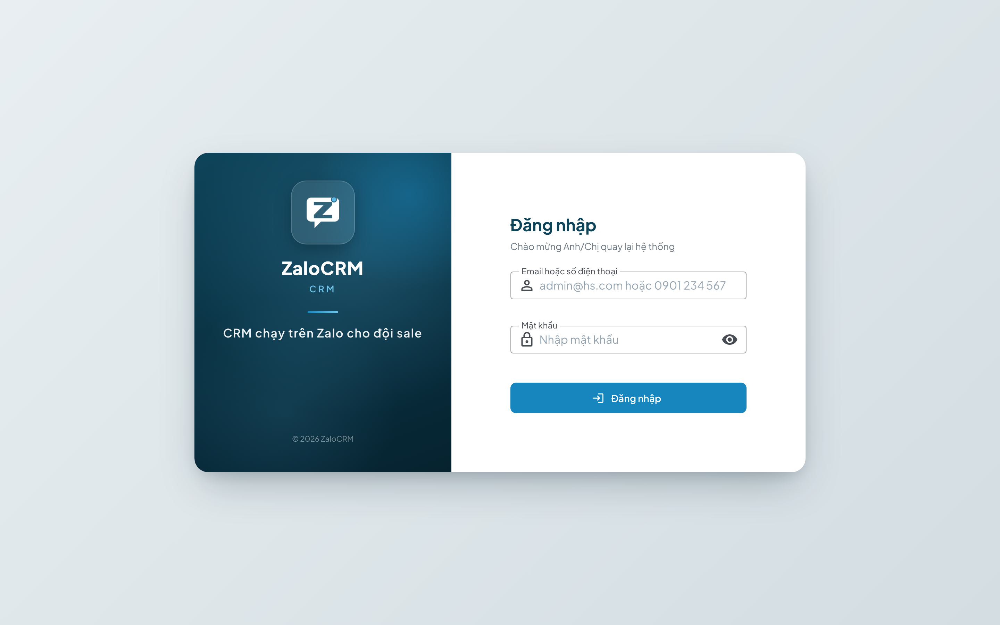

# Chương 1 — Ngày đầu tiên

*Làm theo 15 phút. Xong chương này bạn đã chat được với khách.*

---

## 1.1. Đăng nhập



1. Mở trình duyệt (Chrome / Edge / Cốc Cốc), vào địa chỉ công ty đưa
   → dạng `http://crm.congty.vn` hoặc `http://<địa-chỉ-IP>:3080`
2. Nhập email + mật khẩu admin cấp
3. Lần đầu đăng nhập hệ thống sẽ bắt **đổi mật khẩu** — đổi ngay, đừng bỏ qua

> 💡 **Cài lên máy như một ứng dụng:** ở thanh địa chỉ Chrome có biểu tượng "Cài đặt" (hình màn hình có mũi tên). Bấm vào, ZaloCRM thành một app riêng trên desktop — không lẫn với 20 tab đang mở. Trên điện thoại: menu trình duyệt → "Thêm vào màn hình chính".

---

## 1.2. Đấu nick Zalo — bước quan trọng nhất

Đây là bước biến ZaloCRM từ "một phần mềm" thành "cái Zalo của bạn".

### Các bước

1. Góc trên bên phải, bấm biểu tượng **điện thoại** (tooltip *"Quản lý nick Zalo"*)
   → hoặc vào **Cài đặt → Kênh & Tự động → Tài khoản Zalo**
2. Bấm **Thêm nick**
3. Màn hình hiện **mã QR**
4. Mở **Zalo trên điện thoại** → biểu tượng quét QR (góc trên) → quét mã trên màn hình
5. Trên điện thoại bấm **Đồng ý / Xác nhận đăng nhập**
6. Đợi trạng thái chuyển sang **🟢 Đã kết nối**

**Lặp lại cho từng nick bạn có.** Ba nick = làm ba lần.

### Đặt tên nick cho dễ nhớ

Sau khi đấu xong, đặt tên gợi nhớ theo **công dụng**, không phải theo số:

```
✅ "Hùng — Data lạnh Ocean Park"
✅ "Hùng — KH nóng"
✅ "Hùng — Nhóm cư dân"

❌ "0912345678"
❌ "Zalo 2"
```

Sau này khi cần biết "nick nào đang chăm khách này", tên gợi nhớ cứu bạn.

---

## 1.3. Ba lỗi hay gặp khi quét QR

| Hiện tượng | Nguyên nhân | Cách xử lý |
|---|---|---|
| Bấm nút mà không hiện QR | Trình duyệt chặn / mạng chậm | Tải lại trang (F5), bấm lại |
| Quét mãi không xong, xoay vòng | Nick đang đăng nhập ở quá nhiều nơi | Trên điện thoại: Zalo → Cài đặt → Quản lý thiết bị → đăng xuất bớt thiết bị lạ, rồi quét lại |
| Vừa kết nối xong đã rớt | Nick bị Zalo đánh dấu bất thường | Dùng nick đó trên điện thoại bình thường 2–3 ngày (nhắn tin, gọi điện) rồi đấu lại |

---

## 1.4. Hoàn thiện hồ sơ của bạn

Vào **Cài đặt → Cá nhân → Tài khoản của tôi**:
- Họ tên đầy đủ (hiện trong báo cáo của sếp — đừng để "sale01")
- Ảnh đại diện
- Số điện thoại

---

## 1.5. Kiểm tra: bạn đã sẵn sàng chưa?

Vào menu **Tin nhắn**. Bạn phải thấy:

- ✅ Danh sách hội thoại của **tất cả** các nick đã đấu, trộn chung một cột bên trái
- ✅ Bấm vào một hội thoại → đọc được lịch sử tin nhắn
- ✅ Gõ thử một tin cho chính mình (nick khác) → gửi được, hiện đúng

**Nếu ba dấu ✅ trên đều đạt — bạn đã dùng được ZaloCRM.** Mọi thứ còn lại chỉ là làm nhanh hơn.

---

## 1.6. Điều KHÔNG nên làm trong ngày đầu

| ❌ Đừng | Vì sao |
|---|---|
| Nhập ngay 3.000 SĐT và bấm kết bạn hàng loạt | Nick mới đấu chưa "ấm". Chờ ít nhất 3–5 ngày dùng bình thường. Xem Chương 11. |
| Tắt các giới hạn an toàn cho nhanh | Đây là cách mất nick nhanh nhất |
| Xoá / gộp khách hàng lung tung khi chưa hiểu | Gộp sai khó gỡ. Học ở Chương 13 trước |
| Sửa cấu hình chấm điểm | Để mặc định. Nó đã tune sẵn cho BĐS. Chỉnh sau 3–4 tuần khi có dữ liệu thật |

---

## 1.7. Việc duy nhất cần làm thêm hôm nay

Mở menu **Khách hàng**, bấm **+ Thêm KH**, nhập thử **một khách bạn đang chăm dở**:
- Tên, SĐT
- Trạng thái: chọn đúng bậc khách đang ở
- Ghi chú: viết 2–3 dòng bạn nhớ về khách này (ngân sách, quan tâm căn nào, vướng gì)

Làm một lần để quen thao tác. Ngày mai bắt đầu nhịp làm việc thật.

---

➡️ Tiếp theo: **[Chương 2 — Hiểu màn hình](02-hieu-man-hinh.md)**
