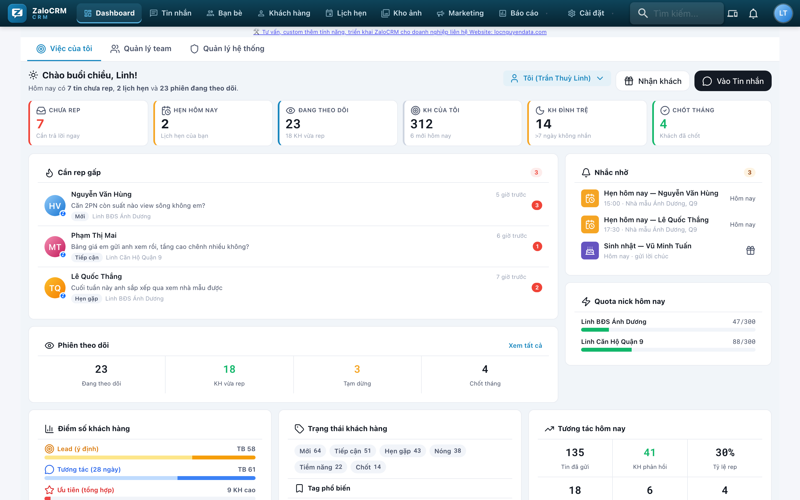
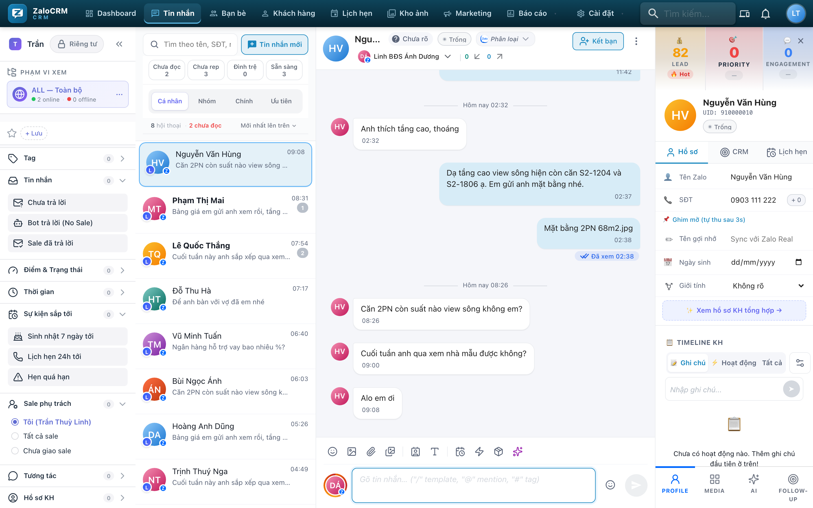
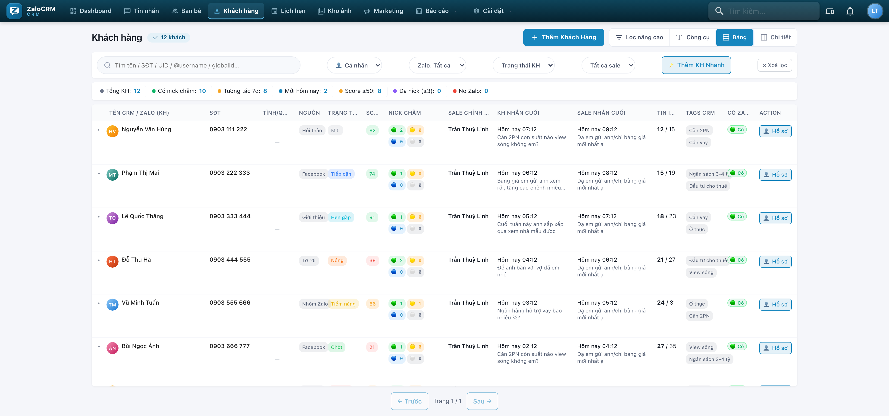
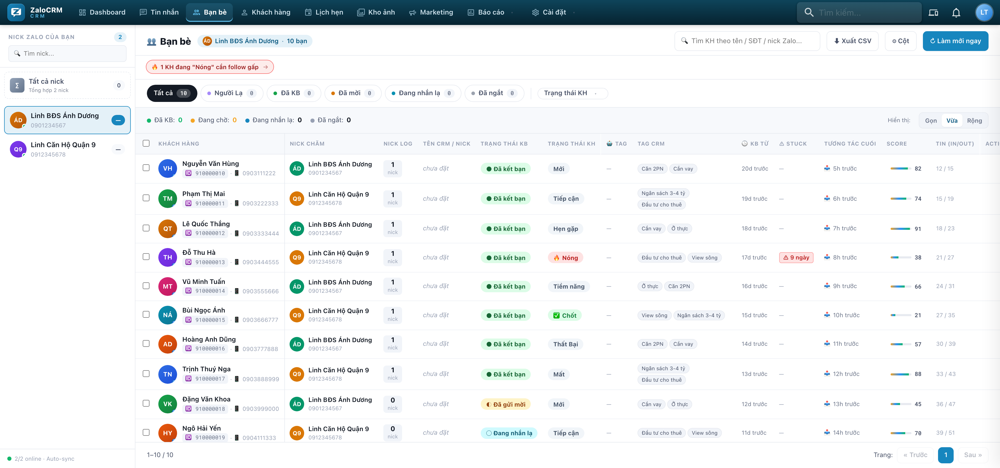
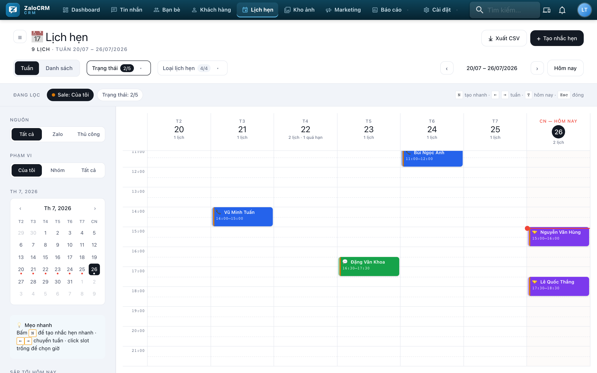
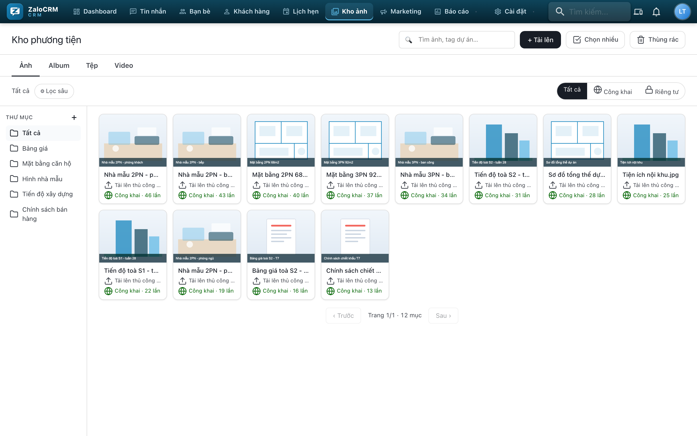

# Chương 2 — Hiểu màn hình

*Tour 20 phút qua từng menu. Không cần nhớ hết — biết cái gì nằm ở đâu là đủ.*

> 📸 **Về ảnh trong chương này:** chụp từ chính app, nhưng tên khách, số điện
> thoại và tên dự án đều là **dữ liệu giả**. Màn hình của bạn sẽ có cùng bố cục,
> khác nội dung.

---

## 2.1. Bản đồ tổng thể

Thanh menu ngang trên cùng:

```
Dashboard · Tin nhắn · Bạn bè · Khách hàng · Lịch hẹn · Kho ảnh · Marketing · Báo cáo · Cài đặt
```

Nhớ theo công dụng:

| Menu | Trả lời câu hỏi |
|---|---|
| **Dashboard** | *Hôm nay tôi phải làm gì trước?* |
| **Tin nhắn** | *Trả lời khách* |
| **Bạn bè** | *Nick nào đã kết bạn với ai?* |
| **Khách hàng** | *Toàn bộ khách của tôi, lọc và sắp xếp* |
| **Lịch hẹn** | *Ai hẹn xem nhà, khi nào?* |
| **Kho ảnh** | *Bảng giá, video, mặt bằng để đâu?* |
| **Marketing** | *Nhập data mới, quét nhóm cư dân* |
| **Báo cáo** | *Số liệu cho sếp / cho chính mình* |

---

## 2.2. Dashboard — bảng điều khiển buổi sáng

Đây là màn hình bạn mở đầu tiên mỗi ngày. Các ô quan trọng:



*Hàng số trên cùng là 6 ô cần liếc mỗi sáng. Cột trái là việc phải làm, cột phải
là lịch và quota nick.*

### Ô hành động (làm ngay)

| Ô | Nghĩa | Việc cần làm |
|---|---|---|
| 🔴 **Cần trả lời ngay** | Khách nhắn mà chưa ai rep | Rep hết. Ưu tiên số 1. |
| 🟠 **KH bỏ quên** | >7 ngày bạn không nhắn gì | Nhắn hỏi thăm hoặc gửi cập nhật tiến độ |
| 🟡 **KH đình trệ** | Kẹt một bậc quá lâu | Xem gợi ý hành động của hệ thống |
| 📅 **Lịch hẹn của bạn** | Hẹn hôm nay + sắp tới | Xác nhận lại với khách trước 1 ngày |
| 🎂 **Hôm nay · gửi lời chúc** | Khách sinh nhật hôm nay | Nhắn chúc — cớ liên hệ tự nhiên nhất trong nghề |

### Ô theo dõi (để biết)

| Ô | Nghĩa |
|---|---|
| **Quota nick hôm nay** | Còn bao nhiêu lượt gửi / kết bạn an toàn. Sắp đầy → dừng lại |
| **Điểm số khách hàng** | Phân bố khách theo Lead / Ưu tiên |
| **Tương tác (28 ngày)** | Khách đang nóng lên hay nguội đi |
| **Trạng thái khách hàng** | Phễu: bao nhiêu ở mỗi bậc |
| **Chốt tháng** | Số khách đã chốt tháng này |

> 💡 **Chỉ cần thuộc 5 ô hành động.** Phần còn lại xem khi rảnh.

---

## 2.3. Tin nhắn — nơi bạn ở 80% thời gian



Ba cột từ trái sang (ảnh trên còn có thêm cột lọc ngoài cùng bên trái):

### Cột trái — danh sách hội thoại

- Trộn chung mọi nick. Chấm màu / avatar cho biết nick nào
- **Bộ lọc** rất đáng dùng:
  - `Chưa đọc` — tin mới
  - `Chưa rep` — khách nhắn mà mình chưa trả lời ⭐
  - `Ưu tiên` — sắp theo điểm ưu tiên, khách nóng lên đầu
  - Theo thời gian, theo nhãn
- **Phạm vi xem** — chọn xem hội thoại của nick nào, hoặc `Toàn bộ`
- **Tab "Khác"** — chỗ nhét hội thoại không quan trọng (nhóm rác, tin hệ thống) cho khuất mắt. Chuột phải vào hội thoại để chuyển

### Cột giữa — khung chat

- Gửi text, ảnh, video, file (PDF bảng giá, Excel quỹ căn), sticker, emoji
- **Kéo thả file thẳng vào khung chat** — nhanh nhất
- Video xem được ngay trong bong bóng chat, không cần tải về
- Trả lời (reply) theo tin, chuyển tiếp cả ảnh/video sang khách khác
- **Gõ `/` → hiện danh sách mẫu tin** ⭐ — xem Chương 8
- 🔔 **Chuông theo dõi** cạnh tên khách — bật để được nhắc riêng khi khách này nhắn

### Cột phải — hồ sơ khách

Đây là chỗ phân biệt CRM với Zalo thường:
- Điểm số + giải thích **vì sao** được điểm đó
- Trạng thái (bậc) — bấm để đổi
- Nhãn đang dán
- **Ghi chú** — viết ngay khi đang chat, không bao giờ quên nữa
- Lịch hẹn liên quan
- Lịch sử hoạt động

---

## 2.4. Khách hàng — danh sách toàn bộ

Dùng khi bạn muốn **chủ động tìm khách để gọi**, thay vì ngồi chờ tin nhắn.



Các cột: tên, SĐT, trạng thái, điểm, sale phụ trách, nick đang chăm, tương tác cuối.

**Ba việc hay làm nhất ở đây:**

1. **Bấm tiêu đề cột Điểm** → sắp từ cao xuống thấp → có ngay danh sách gọi
2. **Lọc** theo trạng thái + nhãn → ví dụ: `Nóng` + nhãn `view-hồ` = danh sách khách sẵn sàng cho quỹ căn view hồ vừa mở
3. **+ Thêm KH** → thêm nhanh khách từ nguồn ngoài (khách đi hội thảo, khách bạn giới thiệu)

Vài ký hiệu bạn sẽ thấy:
- **Nick chăm** — nick nào đang chat với khách này
- **Cùng chăm (N)** — có N sale khác cùng chăm khách này
- **Chưa tìm Zalo / Không tìm thấy Zalo** — SĐT này chưa tra hoặc không có Zalo

---

## 2.5. Bạn bè



Danh sách quan hệ bạn bè Zalo theo từng nick. Dùng để:
- Xem nick nào đã kết bạn với ai
- Biết lời mời kết bạn nào đang chờ, ai đã đồng ý, ai từ chối
- Tìm bạn bè chưa được tạo thành khách hàng trong CRM

---

## 2.6. Lịch hẹn



Lịch xem nhà mẫu, cuộc gọi, buổi tư vấn. Bốn loại: **Gọi · Nhắn · Gặp mặt · Follow-up**.

Chi tiết ở [Chương 7](07-lich-hen-xem-nha.md).

---

## 2.7. Kho ảnh



Thư viện dùng chung của cả sàn: bảng giá, video nhà mẫu, mặt bằng, hình phối cảnh. Có album, đếm lượt dùng.

**Lợi ích thật:** upload một lần, cả team dùng. Không còn cảnh mỗi sale giữ một bản bảng giá cũ 3 tháng và gửi nhầm cho khách.

Chi tiết ở [Chương 8](08-kho-tai-lieu-va-mau-tin.md).

---

## 2.8. Marketing

Bản Community có hai mục:

- **Quét nhóm** — quét nhóm Zalo và danh sách thành viên → [Chương 9](09-nhom-cu-dan-va-nguon-khach.md)
- **Tệp khách hàng** — nhập data SĐT, lọc trùng, chạy kết bạn → [Chương 4](04-tu-data-lanh-den-ban-be.md)

---

## 2.9. Báo cáo

Sáu báo cáo dựng sẵn:

| Báo cáo | Ai dùng |
|---|---|
| Tổng quan điều hành | Sếp |
| Vận hành Nick Zalo | Admin — nick nào rớt, uptime bao nhiêu |
| Hiệu suất Sale & Team | Trưởng nhóm |
| Engagement KH | Sale + trưởng nhóm |
| Audit & Sức khỏe HT | Admin |
| Phân tích nâng cao | Sếp / phân tích |

Xuất Excel được hết. Chi tiết ở [Chương 10](10-truong-nhom-va-quan-ly.md).

---

## 2.10. Cài đặt — chỗ bạn ít vào nhất (và nên thế)

Nhóm theo: **Cá nhân · Tổ chức · Khách hàng & Lead · Kênh & Tự động · Hệ thống**.

Sale thường chỉ cần **Cá nhân → Tài khoản của tôi**. Phần còn lại là việc của admin/trưởng nhóm.

---

## 2.11. Bài tập 5 phút

Làm ngay để nhớ đường:

1. Vào **Tin nhắn**, bật bộ lọc **Chưa rep** → xem có bao nhiêu khách đang chờ bạn
2. Vào **Khách hàng**, bấm cột **Điểm** để sắp giảm dần → nhìn top 10
3. Vào **Dashboard**, tìm ô **KH bỏ quên** → xem có ai >7 ngày bạn quên không

Ba thao tác này là 90% việc bạn làm mỗi ngày.

---

➡️ Tiếp theo: **[Chương 3 — Nhịp một ngày của sale](03-nhip-lam-viec-hang-ngay.md)** ⭐
