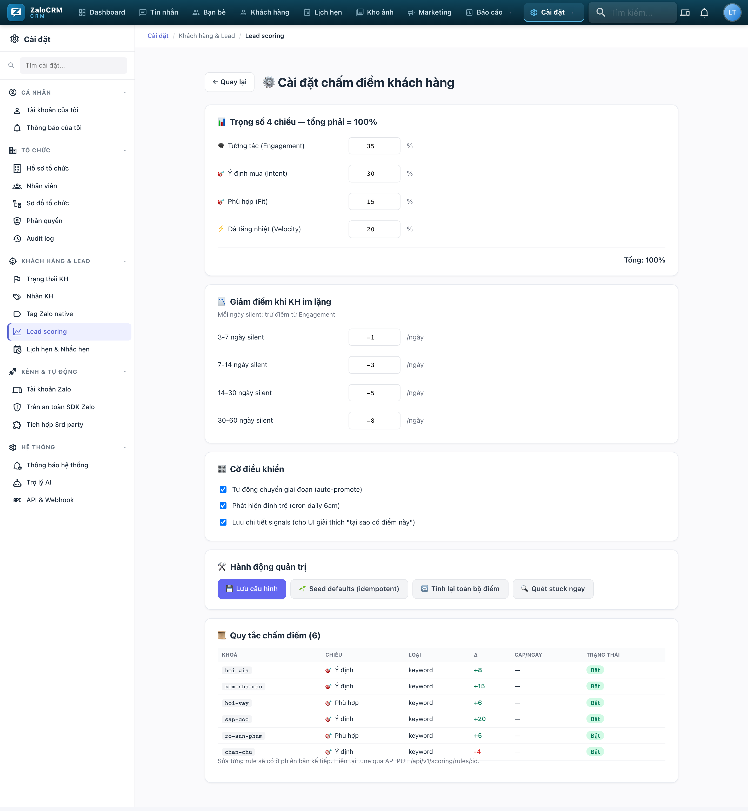

# Chương 6 — Điểm số: hôm nay gọi ai trước

*Hiểu điểm số trong 10 phút, rồi chỉnh nó cho đúng dự án bạn đang bán.*

---

## 6.1. Ba loại điểm — chỉ cần nhớ một

| Điểm | Đo cái gì | Ví dụ dễ hiểu |
|---|---|---|
| **Điểm khách hàng (Lead)** | Mức độ **muốn mua** | Khách hỏi lãi suất, sổ hồng → cao |
| **Điểm tương tác (Engagement)** | Mức độ **chịu nói chuyện** trong 28 ngày | Khách nhắn mỗi ngày → cao |
| ⭐ **Điểm ưu tiên (Priority)** | Trộn hai cái trên | **Con số duy nhất bạn cần nhìn** |

**Công thức:** `Ưu tiên = Lead × 55% + Tương tác × 30% + thưởng/phạt xu hướng`
- Đang nóng lên (tăng ≥20%) → **+10**
- Đang nguội đi (giảm ≥20%) → **−5**

**Vì sao Lead nặng hơn Tương tác:** khách hỏi toàn câu về vay vốn nhưng ít nói (Lead 80, Tương tác 30) đáng gọi hơn khách chat vui vẻ mỗi ngày mà không định mua (Lead 20, Tương tác 80). Người thứ hai là bạn bè, không phải khách hàng.

---

## 6.2. Lead Score được tính thế nào

Bốn trục, mỗi trục một trọng số:

| Trục | Trọng số | Đo gì |
|---|---|---|
| **Tương tác** | 35% | Khách có chịu nói chuyện không |
| **Ý định** | 30% | Khách nói gì — dấu hiệu muốn mua |
| **Phù hợp** | 15% | Khách có hợp dự án không (ngân sách, khu vực, loại hình) |
| **Đà tăng** | 20% | Khách đang nóng lên hay nguội đi |

### Điểm CỘNG — khách nói gì

| Khách nhắn | Điểm |
|---|---|
| *"trả trước bao nhiêu / vay được không / lãi suất / trả góp"* | **+20** |
| *"sổ hồng / sổ đỏ / hợp đồng / công chứng / pháp lý / thủ tục"* | **+18** |
| *"giá bao nhiêu / giá thật / rao bao nhiêu"* | **+15** |
| *"khi nào bàn giao / tháng nào ký / cuối năm / sang năm"* | **+15** |
| *"tài liệu / bảng giá / brochure / gửi file"* | **+12** |
| *"vị trí / view / hướng / diện tích / tầng / số phòng"* | **+10** |
| *"ưu đãi / khuyến mãi / chiết khấu / giảm giá / tặng"* | **+10** |
| *"vợ em / chồng em / gia đình / bố mẹ"* | **+8** |

### Điểm CỘNG — hành động

| Việc xảy ra | Điểm |
|---|---|
| Đặt cọc giữ chỗ | **+50** |
| Ký hợp đồng mua bán | **+50** |
| **Hoàn thành buổi xem nhà** | **+35** |
| Đặt lịch xem nhà | **+25** |
| Đã nhận báo giá | **+15** |
| **Khách chủ động chat lại sau im lặng** | **+15** ⭐ |
| Chuỗi hành động (đặt lịch → đi xem → đàm phán) | **+15** |
| Ngân sách khớp dự án | **+20** |
| Người thân đã mua cùng dự án | **+15** |
| Khách gửi voice / gọi video | **+8** |
| Khách nhắn tin (tối đa +15/ngày) | +3 mỗi tin |
| Khách rep dưới 5 phút | +5 |
| 3 ngày liên tiếp có tương tác | +5 |

### Điểm TRỪ

| Việc xảy ra | Điểm |
|---|---|
| Khách từ chối lịch hẹn | **−10** |
| Khách so sánh giá đối thủ | **−8** |
| ⚠️ **Sale phản hồi chậm > 24h** | **−5** ← *chấm cả bạn* |
| Khách "seen" không rep (tối đa −9/ngày) | −3 |
| Khách rep cụt lủn 1–2 từ | −2 |

### Tự rơi điểm khi im lặng

| Khách im | Rơi mỗi ngày |
|---|---|
| 3–7 ngày | −1 |
| 7–14 ngày | −3 |
| 14–30 ngày | −5 |
| **30–60 ngày** | **−8** |

Đây là lý do danh sách của bạn tự sạch mà không cần dọn: khách "để em suy nghĩ" rồi mất tích sẽ tự tụt xuống đáy.

---

## 6.3. Đọc bảng giải thích điểm — kỹ năng quan trọng nhất chương này

Mở hồ sơ khách (cột phải trong Tin nhắn), bấm vào điểm số:

```
Chị Trần Thị Mai — Ưu tiên 91  🔥 đang nóng lên

Ý định         76/100
├─ Hỏi về thanh toán              +20   (hôm qua)
├─ Hỏi thủ tục pháp lý            +18   (hôm qua)
├─ Hoàn thành lịch xem nhà        +35   (3 ngày trước)
└─ Đã nhận báo giá                +15   (2 ngày trước)

Tương tác      82/100
├─ 14 tin nhắn trong 3 ngày       +15/ngày
├─ Rep dưới 5 phút × 4             +20
└─ Gửi voice                       +8

Phù hợp        55/100
└─ Ngân sách khớp dự án           +20

Đà tăng        70/100
├─ 3 ngày liên tiếp tương tác      +5
└─ Chuỗi: đặt lịch → xem → hỏi giá +15
```

**Nhìn bảng này bạn biết ngay phải làm gì:**
Chị Mai đã đi xem, đã nhận báo giá, đang lo tiền và pháp lý, và rep rất nhanh.
→ **Gọi ngay hôm nay**, mang theo phương án vay cụ thể và bộ hồ sơ pháp lý. Không phải nhắn "chị xem thế nào rồi ạ".

Đây là khác biệt giữa CRM có chấm điểm và một danh sách Excel: **nó không chỉ nói gọi ai, mà nói gọi để làm gì.**

---

## 6.4. Nhóm khách theo điểm — cách chia thời gian

| Ưu tiên | Nhóm | Bạn làm gì |
|---|---|---|
| **80–100** | 🔥 Nóng bỏng | **Gọi điện trong ngày.** Đừng chat. |
| **60–79** | 🟠 Ấm | Chat sâu, đẩy đi xem nhà |
| **40–59** | 🟡 Bình thường | Nuôi bằng nội dung, 1 tuần/lần |
| **20–39** | 🔵 Nguội | Nội dung định kỳ, 2 tuần/lần |
| **0–19** | ⚫ Lạnh | Chiến dịch dài hạn, 1 tháng/lần |

**Phân bổ thời gian gợi ý:**
```
60% thời gian → nhóm 80-100 và 60-79   (đây là tiền)
25% thời gian → nhóm 40-59              (đây là tiền tháng sau)
15% thời gian → còn lại                 (đây là tiền quý sau)
```

**Sai lầm phổ biến:** dành cả ngày chat với khách nhóm 40–59 vì họ dễ nói chuyện, trong khi khách 90 điểm đang chờ một cuộc gọi để cọc.

---

## 6.5. Điểm tương tác & 6 kiểu khách

Hệ thống theo dõi hành vi 28 ngày và xếp khách vào 6 nhóm:

| Nhãn | Nghĩa | Việc cần làm |
|---|---|---|
| 🔥 **hot** | Tăng ≥20% so tuần trước, đang rất tích cực | **Đẩy mạnh ngay.** Cửa sổ này không mở lâu |
| 🏆 **champion** | Tương tác cao và đều suốt 28 ngày | Khách trung thành — xin giới thiệu |
| ✅ **stable** | Đều đặn, ổn định | Duy trì nhịp |
| 🧊 **cooling** | Giảm ≥30% | ⚠️ **Cứu ngay** — đổi cách tiếp cận, gọi điện |
| ❄️ **cold** | Gần như im suốt 28 ngày | Chiến dịch đánh thức |
| ⚪ **noise** | Chưa đủ dữ liệu (<5 tương tác) | Khách quá mới, chờ thêm |

⭐ **Nhóm `cooling` là nhóm quan trọng nhất để can thiệp.** Khách đang nguội nhưng chưa mất — đây là lúc cứu được. Khi đã thành `cold` thì khó hơn nhiều.

**Xem ở đâu:** Báo cáo → **Engagement KH**. Nên xem mỗi thứ Hai.

---

## 6.6. Chỉnh điểm số cho dự án của bạn

**Cài đặt → Khách hàng & Lead → Lead scoring**



*Bốn ô trọng số ở trên là bộ mặc định (35/30/15/20). Bảng từ khoá bên dưới là chỗ
bạn thêm từ đặc thù dự án của mình.*

> ⏳ **Đừng chỉnh trong 3–4 tuần đầu.** Để hệ thống chạy mặc định, tích luỹ dữ liệu thật, rồi mới điều chỉnh dựa trên khách thật của bạn.

### Việc đáng làm nhất: thêm từ khoá riêng

Bộ mặc định là từ khoá BĐS chung. Thêm từ khoá đặc thù Vinhomes:

| Nhóm từ khoá đề xuất | Trục | Điểm |
|---|---|---|
| `quỹ căn`, `còn căn nào`, `giỏ hàng`, `bảng hàng` | Ý định | +12 |
| `căn góc`, `view hồ`, `view nội khu`, `view quảng trường` | Ý định | +10 |
| `suất ngoại giao`, `booking`, `giữ chỗ`, `đặt chỗ` | Ý định | **+25** |
| `ân hạn gốc`, `hỗ trợ lãi suất`, `vay 70%`, `0% trong 24 tháng` | Ý định | **+20** |
| `phí quản lý`, `phí dịch vụ`, `ban quản lý` | Ý định | +8 |
| `cho thuê lại`, `dòng tiền`, `lợi suất`, `khai thác` | Ý định | +12 |
| `bàn giao thô`, `full nội thất`, `nội thất liền tường` | Ý định | +10 |
| `hợp đồng mua bán`, `hđmb`, `phụ lục`, `thanh lý` | Ý định | **+20** |
| `sang tên`, `chuyển nhượng`, `chênh` | Ý định | +12 |

### Thêm từ khoá tiêu cực đáng bắt

| Từ khoá | Điểm |
|---|---|
| `đắt quá`, `cao quá`, `vượt ngân sách` | −5 |
| `mua rồi`, `chốt bên khác`, `đã đặt cọc bên` | **−20** |
| `không quan tâm`, `đừng nhắn nữa`, `spam` | **−25** *(và đặt trạng thái đồng ý = từ chối)* |

### Chỉnh trọng số theo loại sản phẩm

| Bạn bán | Nên chỉnh |
|---|---|
| **Căn hộ trung cấp, khách mua ở** | Giữ mặc định (E35/I30/F15/V20) |
| **Biệt thự, sản phẩm cao cấp** | Tăng **Phù hợp** lên 25%, giảm Tương tác xuống 25% — khách giàu ít chat nhưng ngân sách khớp là quyết nhanh |
| **Sản phẩm đầu tư, khách đầu cơ** | Tăng **Đà tăng** lên 30% — nhóm này quyết rất nhanh, ai chậm là mất |

### Chỉnh tốc độ rơi điểm

| Thị trường | Nên |
|---|---|
| Sôi động, mở bán liên tục | Rơi nhanh hơn (−2/−5/−8/−12) — khách nguội là mất thật |
| Trầm lắng, chu kỳ mua dài | Rơi chậm hơn (−1/−2/−3/−5) — khách cân nhắc 6 tháng là bình thường |

---

## 6.7. Chỉnh ngưỡng cảnh báo khách kẹt

**Cài đặt → Khách hàng & Lead → Lead scoring → phần ngưỡng đình trệ**

Mặc định:

| Bậc | Ngưỡng | Gợi ý hành động |
|---|---|---|
| Mới | 7 ngày | Chưa được tiếp cận — liên hệ ngay |
| Tiếp cận | 14 ngày | Gửi video tour + bảng giá |
| Hẹn gặp | 30 ngày | Đề xuất gọi video / tour 360° |
| Nóng | 21 ngày | Push ưu đãi tháng này |
| Tiềm năng | 14 ngày | Gọi điện trực tiếp |

**Nên chỉnh theo thực tế của bạn:** nếu chu kỳ bán biệt thự của sàn bạn dài (khách cân nhắc 2–3 tháng là bình thường), nới ngưỡng lên. Ngưỡng quá chặt → cảnh báo tràn ngập → sale bỏ qua hết → tính năng thành vô dụng.

---

## 6.8. Sửa mẫu tin gợi ý (Next Best Action)

Đây là mẫu tin hệ thống đưa ra khi khách kẹt. **Bắt buộc sửa lại cho đúng dự án bạn bán** — mẫu mặc định viết chung chung.

Các biến dùng được: `{{customerName}}`, `{{projectName}}`, `{{promoMonth}}`, `{{viewingLink}}`, `{{unitInfo}}`, `{{priceInfo}}`, `{{progressUpdate}}`, `{{callTime}}`

**Ví dụ sửa cho Ocean Park:**

```
Mặc định:
"Anh/chị {{customerName}}, em gửi video giới thiệu nhanh dự án
{{projectName}} ({{viewingLink}}) và bảng giá chi tiết..."

Sửa thành:
"Anh/chị {{customerName}}, em gửi anh/chị tour 360° phân khu
The Zenpark — Ocean Park 2: {{viewingLink}}
Anh/chị xem trước ở nhà cho tiện, thích căn nào em gửi bảng tính
chi tiết căn đó ạ. Tháng này còn chính sách {{promoMonth}}."
```

**Đặc biệt nên sửa mẫu "khách kẹt ở bậc Hẹn gặp"** — với khách tỉnh mua Ocean Park/Grand Park, lời mời gọi video tour thay vì đi xem trực tiếp là cách gỡ hiệu quả nhất.

---

## 6.9. Ba hiểu lầm về điểm số

**❌ "Điểm cao = chắc chắn mua"**
Điểm đo tín hiệu, không đo kết quả. Khách 95 điểm vẫn có thể không vay được. Điểm giúp bạn **xếp thứ tự**, không thay bạn phán đoán.

**❌ "Điểm thấp = bỏ đi"**
Khách mới vào luôn điểm thấp vì chưa có dữ liệu. Khách trầm tính điểm cũng thấp. Đọc thêm ghi chú và bối cảnh.

**❌ "Tuần đầu điểm phải chuẩn"**
Hệ thống cần dữ liệu chat thật để chấm. Tuần 1–2 điểm gần như vô nghĩa. Từ tuần 4 trở đi mới đáng tin.

---

## 6.10. Bài tập 10 phút

1. Mở **Khách hàng**, sắp theo điểm giảm dần
2. Lấy 3 khách đầu, mở bảng giải thích điểm từng người
3. Với mỗi người, viết ra giấy **một hành động cụ thể** dựa trên lý do được điểm
4. Làm luôn 3 hành động đó

Nếu thấy hữu ích — đó chính là cách dùng điểm số. Nếu thấy điểm sai — quay lại mục 6.6 và chỉnh từ khoá cho đúng cách khách của bạn nói chuyện.

---

➡️ Tiếp theo: **[Chương 7 — Lịch xem nhà mẫu](07-lich-hen-xem-nha.md)**
