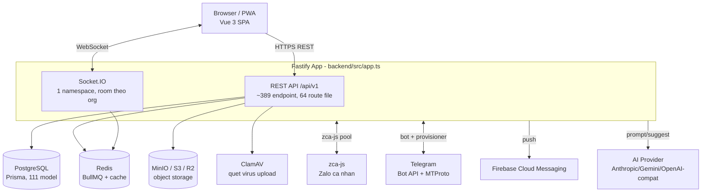
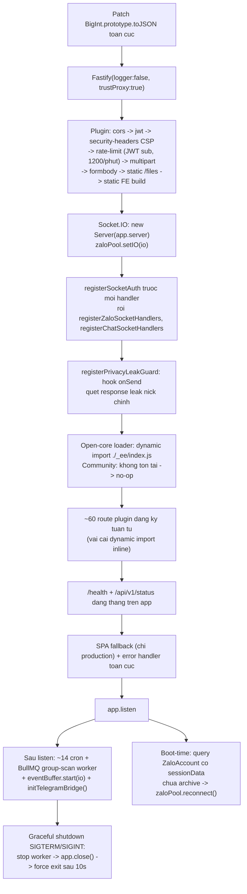
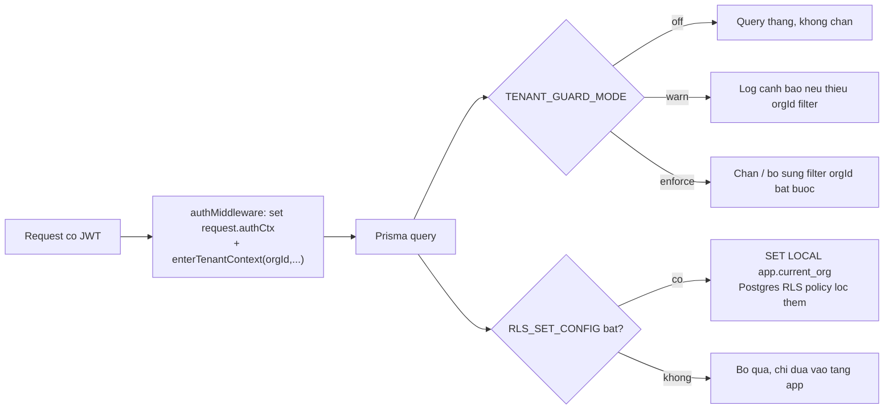
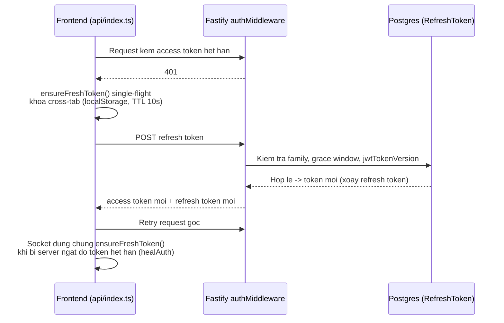
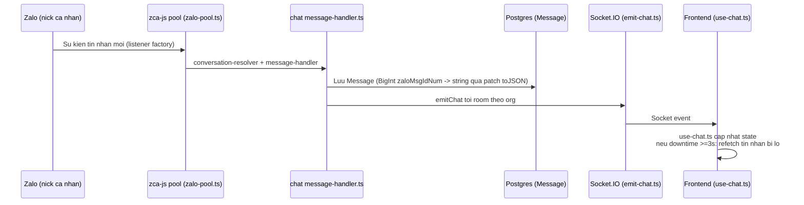

# Kiến trúc hệ thống ZaloCRM

Cập nhật: 2026-08-03 · Phiên bản: v3.4.0 · Phạm vi: bản Community

Tài liệu này mô tả kiến trúc runtime — luồng khởi động, multi-tenant, auth, realtime, async, dữ liệu, storage, open-core, deploy, bảo mật. Bản đồ file/module xem [`codebase-summary.md`](./codebase-summary.md). Diagram cũ (đã lệch số liệu: ghi 23 module/93 model, thực tế 25 module/111 model) xem [`docs/architecture/README.md`](./architecture/README.md) — chỉ dùng tham khảo bố cục, không dùng số liệu.

## 1. Sơ đồ tổng thể

## 2. Luồng khởi động `backend/src/app.ts`

Nguồn: `backend/src/app.ts`. Toàn bộ trong 1 hàm `bootstrap()`.

Ghi chú:
- `trustProxy: true` bắt buộc vì chạy sau Cloudflare/nginx (tránh bug rate-limit theo IP sai).
- `uncaughtException` / `unhandledRejection`: chỉ log, cố ý không crash process.
- Migration **không** chạy tự động lúc app start (xem §9).

## 3. Mô hình multi-tenant (3 lớp)

Mọi resource có FK `orgId`. Enforce theo 3 lớp độc lập, có thể bật/tắt qua env (`backend/src/shared/tenant/`, `backend/src/shared/database/prisma-client.ts`):

1. **AsyncLocalStorage tenant context** — `backend/src/shared/tenant/tenant-context.ts`: `{orgId, userId, role, bypassTenantGuard, rlsConfigApplied}`, hàm `enterTenantContext`, `withTenant`, `runSystemQuery`.
2. **Prisma `$extends` guard** — `backend/src/shared/database/prisma-client.ts` + `tenant-guard.ts`, mức nghiêm ngặt theo `TENANT_GUARD_MODE` (`off|warn|enforce`).
3. **Postgres RLS (tuỳ chọn)** — `prisma/rls/tenant-rls.sql`, bật qua `RLS_SET_CONFIG`, áp dụng bằng `SET LOCAL app.current_org` khi request vào.

## 4. Auth & token — luồng refresh

Nguồn: `backend/src/modules/auth/`, `frontend/src/api/index.ts`, `frontend/src/api/socket.ts`. Access token ngắn hạn (mặc định 15 phút — `ACCESS_TOKEN_TTL`); refresh token xoay vòng có family, sliding TTL 30d, hạn tuyệt đối family 90d, grace window 20s cho đua nhiều tab (`backend/src/modules/auth/refresh-token-service.ts`, model `RefreshToken`). `jwtTokenVersion` trên `User` dùng để thu hồi hàng loạt (vd khi upgrade, `zalocrm-deploy.sh` tăng version toàn bộ user để ép đăng nhập lại).

- FE: `frontend/src/api/index.ts` — interceptor 401 gọi `ensureFreshToken()`, `clearAuthAndRedirect()` khi refresh thất bại; đây là nguồn chân lý duy nhất cho cả HTTP và socket.
- Socket: `frontend/src/api/socket.ts` — server chủ động ngắt (`'io server disconnect'`) khi access token hết hạn (15 phút); FE bắt sự kiện, gọi lại `ensureFreshToken()` rồi `socket.connect()`; giới hạn 5 lần retry/60s.

### RBAC 2 tầng

- **Legacy**: `role-middleware.ts` — `requireRole('owner','admin')`, giữ song song để dual-read.
- **Mới**: `backend/src/modules/rbac/` — resource × action (18 RESOURCES × 5 ACTIONS: access/create/edit/delete/view_all) theo Department/PermissionGroup; middleware `requireGrant(resource, action)`, `requireAnyGrant(...)`; `role === 'owner'` bypass grant trong giai đoạn migrate.
- FE: `frontend/src/router/index.ts` (guard theo `meta.resource` + `authStore.canAccess(resource, action)`, bypass `meta.managerOr`), `frontend/src/stores/auth.ts` (`canAccess()`).

## 5. Realtime — luồng tin nhắn Zalo → app → client

- Socket.IO dùng 1 `Server` global, chỉ default namespace (không `io.of()`), room theo org. Auth qua `registerSocketAuth` (JWT + join room).
- Handler: `backend/src/modules/zalo/zalo-socket.ts`, `backend/src/modules/chat/chat-operations-routes.ts`. Helper emit: `backend/src/shared/realtime/emit-chat.ts`.
- FE có 5 socket consumer: `use-chat.ts`, `use-friend-socket.ts`, `use-muc-tieu-socket.ts`, `use-zalo-presence.ts`, `use-zalo-accounts.ts`.
- `event-buffer.ts` (`shared/`) — buffer sự kiện, `eventBuffer.start(io)` chạy sau `app.listen`.

## 6. Async — queue & cron

Nguồn: `backend/src/app.ts`, `backend/src/modules/zalo/group-scan-queue.ts` và các file `*-cron.ts` trong `backend/src/modules/`.

- **BullMQ**: bản Community có **2 queue**: `group-scan` (`backend/src/modules/zalo/group-scan-queue.ts`) và `group-broadcast` (`group-broadcast-queue.ts`, gửi tin hàng loạt vào nhóm theo lịch — worker `concurrency: 1`, gửi tuần tự để chống spam). Cả hai dùng Redis riêng (`ioredis`, `maxRetriesPerRequest: null`), 3 attempt + backoff mũ 10s, `removeOnComplete` 24h/1000, `removeOnFail` 7d. Các queue automation/marketing khác thuộc bundle `_ee` (không có trong checkout Community). `bull-board` có sẵn dependency nhưng chỉ được mount bởi `_ee`.
- **node-cron** (~16 job, khởi động sau `app.listen`):

| Cron | Lịch |
|---|---|
| interaction-cron (silent_30d) | 02:00 VN |
| engagement-cron | 02:30 VN |
| presence-service | mỗi 60s |
| friend-sync-cron | mỗi 15 phút |
| group-info-sync-cron | mỗi 6 giờ |
| contact-profile-sync-cron | 03:00 VN |
| status-log-checkpoint-cron | mỗi 5 phút |
| scoring-scheduler | decay mỗi giờ + stuck 06:00 |
| contact-autotags-dirty | mỗi 5 phút |
| media-trash-gc-cron | 03:30 VN (mặc định dry-run) |
| labels background sync | mỗi 60s |
| group-broadcast-cron (materialize run từ lịch) | mỗi phút, catch-up 10 phút sau restart, cap 20 run/tick (`group-broadcast-cron.ts`) |
| group-broadcast sweeper (đánh dấu run kẹt `QUEUE_TIMEOUT`/`WORKER_STALLED`) | mỗi 5 phút |
| birthday-cron lập kế hoạch (dựng hàng đợi lời chúc trong ngày) | mỗi 10 phút (`birthday-cron.ts`) |
| birthday-cron gửi (nhặt lời chúc đã tới `dueAt`) | mỗi phút, cap 5 lời chúc/tick, giãn cách 30–90s |
| appointment-reminder, zalo-health-check, contact-intelligence | chạy nền liên tục sau boot |

## 7. Tầng dữ liệu

- 1 file `backend/prisma/schema.prisma`: **122 model, 2 enum**, generator `prisma-client-js`, datasource `postgresql`, adapter `@prisma/adapter-pg` (Prisma 7 bắt buộc adapter tường minh).
- **115 migration** (`prisma/migrations/YYYYMMDDHHMMSS_name`): các mốc lớn gồm RBAC phase, privacy/OTP, lead pool, automation/marketing rebuild BullMQ, lead-gen Facebook/TikTok/Zalo Ads, Telegram bridge, media library, engagement, sequence/scheduling, tag taxonomy v2, refresh token, gửi nhóm theo lịch (`20260803124500_group_broadcast`), chúc sinh nhật tự động (`20260806100000_birthday_greeting`).
- `prisma-client.ts` dùng `$extends` để: tự derive `phoneNormalized` khi ghi `Contact`, strip NULL byte cho mọi string write, bọc `SET LOCAL` cho RLS qua `tenantTransaction`.
- Seed: `prisma/seeds/seed-message-templates.ts`, entry `prisma/seed.ts` (`npm run db:seed`).
- Nhóm model chính (theo domain, xem chi tiết trong `schema.prisma`): Org/Team/User/RefreshToken/Department/PermissionGroup (tenancy+auth) · ZaloAccount/SdkLimit/ZaloAccountStatusLog/ZaloAccountAccess (pool nick Zalo) · Contact/Status/Conversation/Message/Note/CrmTag(Group)/Tag(Group)/FriendTag/ContactTag (CRM core) · Appointment/AppointmentActionLink · Friend/FriendshipAttempt/GroupMember/GroupScan/GroupPoll/Block(Folder) · Scoring* (ScoringConfig/ScoreSignalRule/StageTransitionRule/StuckThreshold/NbaTemplate) · AutomationRule/Sequence*/Trigger*/Broadcast/Campaign/EventLog/CareSession(Event)/TriggerQueueEntry · MessageTemplate(Folder) · GroupBroadcast/GroupBroadcastRun/GroupBroadcastTarget (gửi nhóm hàng loạt theo lịch) · BirthdayGreetingConfig/BirthdayGreeting (chúc sinh nhật tự động) · AiConfig/AiSuggestion(Applied) · LeadRequest/LeadPool*/LeadNotifyAck · Facebook*/Tiktok*/ZaloOa*/ZaloForm*/ZaloLeadEvent · MediaBlob/MediaAsset/MediaAlbum(Item)/MediaUsageEvent · CustomerList/CustomerListEntry/SaleAssignmentState · TelegramBridgeConfig/TelegramTopicMap/TelegramUserLink · SystemNotification(Recipient) · Integration/SyncLog/WebhookLog · DuplicateGroup/ParentCandidate · ContactAccess/ContactEngagementDaily · SavedReport/SavedFilterPreset · PrivacyOtpToken/UserPrivacySession.

## 8. Storage

- Driver chọn qua `STORAGE_DRIVER` (`local` mặc định | `r2`) — 2 trục thuật ngữ khác nhau, cần phân biệt:
  - **Trục 1 — driver tầng app**: `local-driver.ts` (đĩa VPS tại `UPLOAD_DIR`, phục vụ qua route static `/files`, không phụ thuộc dịch vụ ngoài) vs `r2-driver.ts` (S3-compatible qua `@aws-sdk/client-s3`, dùng `S3_*` env).
  - **Trục 2 — MinIO trong docker-compose**: luôn có mặt như 1 service (`minio` + `minio-init`). Trong deploy thực tế, `zalocrm-deploy.sh` set `S3_ENDPOINT=http://minio:9000` nên driver `r2` trỏ vào chính MinIO nội bộ, không nhất thiết là Cloudflare R2 thật.
- `scripts/migrate-storage-rclone.sh` — copy object từ MinIO sang đích mới (`disk` hoặc `r2`) bằng rclone.
- `scripts/migrate-storage-urls.sh` — rewrite URL public trong DB (`media_blobs.public_url`, `media_assets.thumbnail_url`, `messages.attachments/content/metadata`, `organizations.welcome_image_url/logo_url`) sang `NEW_BASE`; **mặc định dry-run**, cần `CONFIRM=1`.
- Cấu hình R2 chi tiết: [`HUONG-DAN-CAU-HINH-CLOUDFLARE-R2.md`](./HUONG-DAN-CAU-HINH-CLOUDFLARE-R2.md).

## 9. Tích hợp ngoài

| Tích hợp | File wiring | Ghi chú |
|---|---|---|
| zca-js (Zalo cá nhân, SDK không chính thức) | `backend/src/modules/zalo/zalo-pool.ts`, `zalo-listener-factory.ts`, `friend-event-handler.ts`, `group-routes.ts`, `profile-operations.ts`, `friend-sync-service.ts`, `group-scan-worker.ts`, `proxy-util.ts`; dùng lại ở `shared/zalo-operations.ts`, `voice-sender.ts`, `video-processor.ts` | Pool connection theo account, dùng ở nhiều module (chat/contacts/system-notifications/campaign/media) |
| Telegram | `modules/integrations/providers/telegram-bridge/provisioner.ts` (package `telegram`/MTProto-GramJS); `telegram-api.ts`, `receiver.ts`, `link.ts`, `index.ts` (`initTelegramBridge()`); `providers/telegram-bot.ts` (legacy Bot API) | Cầu 2 lớp: Bot API + MTProto provisioner. Cấu hình: [`HUONG-DAN-CAU-HINH-TELEGRAM-BRIDGE.md`](./HUONG-DAN-CAU-HINH-TELEGRAM-BRIDGE.md) |
| Firebase Cloud Messaging | `modules/push/push-service.ts` | Chỉ nơi dùng `firebase-admin` |
| AWS S3 / Cloudflare R2 | `shared/storage/r2-driver.ts` | Dùng khi `STORAGE_DRIVER=r2` (xem §8) |
| AI provider (Anthropic/Gemini/OpenAI-compat/Qwen/Kimi) | `modules/ai/providers/*` | Cấu hình qua `AI_DEFAULT_PROVIDER`/`AI_DEFAULT_MODEL` + biến theo provider |
| sharp | `modules/media/media-service.ts` | Xử lý ảnh |
| exceljs | `modules/dashboard/excel-sheet-builders.ts`, `report-routes.ts` | Export Excel |

## 10. Kiến trúc open-core

- **Backend**: `app.ts` dùng `dynamic import('./_ee/index.js')` với specifier **không phải literal** (để TypeScript không resolve tĩnh lúc build). Bản Community: thư mục `_ee/` không tồn tại → `extensionBundle = null` → mọi hook `ee?.registerExtensionEarly / registerExtensionRoutes / startExtensionJobs` là no-op. Registry `shared/ee-registry/*` (`automation.ts`, `event-bus.ts`, `integrations.ts`) là điểm Community gọi vào, tự no-op khi thiếu `_ee`.
- **Frontend**: `vite.config.ts` alias `@ee` → `./src/_ee` nếu tồn tại, ngược lại tự fallback `./src/_ee-stubs` (phát hiện qua `existsSync`, không cần env flag). Stub phải giữ API tương thích với bundle `_ee` private thật: `isExtension`, `eeSettingsItems`, `eeTopNavShortcuts`, `eeSettingsChildren`, `eeReportsChildren`, `eeTopRoutes`, type `Block`.
- CI guard: `scripts/check-no-ee-leak.sh` được nhắc trong comment (`backend/src/modules/zalo/group-scan-queue.ts`) nhưng **không tồn tại** trong checkout — hiện chỉ là quy ước, chưa có gate tự động.
- Gating diễn ra ở mức code/nhánh (xác nhận qua git log: `feat(community): ẩn report Pipeline + Automation ở Community (EE-only)`, `feat(community): move Tệp khách hàng (Lists) ra core`), không có env flag `EE_*` nào trong `.env.example`.
- License: AGPL-3.0 + tuỳ chọn thương mại. `NOTICE` yêu cầu giữ banner attribution UI và link "Mã nguồn" ở trang login (AGPL §7(b)/§13) — không được gỡ/ẩn khi chưa có license thương mại.

## 11. Topology triển khai

`docker-compose.yml` (production) — 7 service:

| Service | Image/Build | Port host | Ghi chú |
|---|---|---|---|
| `app` | build `docker/Dockerfile` | `${APP_PORT:-3080}:3000` | `depends_on` db/minio/redis (`service_healthy`); volume `file_storage:/var/lib/zalo-crm/files`; `no-new-privileges` |
| `db` | `postgres:16-alpine` | `127.0.0.1:${DB_PORT:-5433}:5432` | healthcheck `pg_isready`; Postgres `timezone=UTC` cố ý (Prisma đọc timestamp theo UTC) dù container `TZ=Asia/Ho_Chi_Minh` cho log |
| `redis` | `redis:7-alpine` | `127.0.0.1:${REDIS_PORT:-6379}:6379` | AOF `everysec`, `maxmemory 256mb noeviction`; bắt buộc cho BullMQ |
| `minio` | `minio/minio:latest` | `${MINIO_PORT:-9000}:9000` (public) + `127.0.0.1:${MINIO_CONSOLE_PORT:-9001}:9001` | fail cứng nếu thiếu `MINIO_ROOT_USER`/`PASSWORD` |
| `minio-init` | `minio/mc:latest` | — | one-shot: tạo bucket, set anonymous **download** |
| `backup` | `prodrigestivill/postgres-backup-local` | — | `@daily` pg_dump, giữ 7d/4w/3m |
| `clamav` | `clamav/clamav:1.4` | — | tuỳ chọn, không `depends_on`, mặc định fail-open (`MEDIA_AV_ENABLED=0`) |

`docker-compose.dev.yml` — chỉ `db` (postgres:16-alpine, port 5433); backend/frontend chạy native.

`docker/Dockerfile` — 3 stage: `frontend-builder` (npm build) → `backend-builder` (cài `vips-dev build-base python3` cho sharp, `prisma generate`, `tsc`) → runtime (`tini ffmpeg tzdata vips`, `ENTRYPOINT tini`, `CMD node dist/app.js`, expose 3000).

**Migration không tự chạy lúc container start** (cố ý bỏ `prisma migrate deploy` khỏi entrypoint — pattern `db push --accept-data-loss` trước đó từng làm mất cột). `scripts/zalocrm-deploy.sh` chạy `prisma migrate deploy` như 1 bước riêng trong quy trình upgrade (backup → `docker compose up -d --build` → `wait_app` → `prisma migrate deploy` → cutover tăng `jwtTokenVersion` → restart → health check). Runbook đầy đủ: [`HUONG-DAN-TRIEN-KHAI-PRODUCTION-COMMUNITY.md`](./HUONG-DAN-TRIEN-KHAI-PRODUCTION-COMMUNITY.md).

## 12. Bảo mật xuyên suốt

| Cơ chế | Vị trí | Mặc định |
|---|---|---|
| CSP | `shared/security/security-headers.ts`, biến `CSP_MODE` | `report-only` |
| Rate limit | `@fastify/rate-limit`, key theo JWT `sub`, fallback IP | 1200/phút, chỉ áp `/api/` |
| HMAC webhook | `shared/security/hmac.ts` | ký/xác thực webhook ngoài |
| ClamAV | `shared/security/clamav-client.ts`, service `clamav` trong compose | fail-open (`MEDIA_AV_ENABLED=0`) |
| SSRF guard | `shared/utils/ssrf-guard.ts` | chặn request tới địa chỉ nội bộ |
| Privacy leak guard | `modules/privacy`, `privacy-leak-guard.ts` | hook `onSend` toàn cục quét "nick chính" chưa redact |
| trustProxy | `Fastify({ trustProxy: true })` | bắt buộc vì chạy sau reverse proxy |

`SECURITY.md` ở root hiện vẫn là template GitHub chưa điền (bảng version giả) — gap thật, chưa có chính sách báo lỗi bảo mật chính thức.
